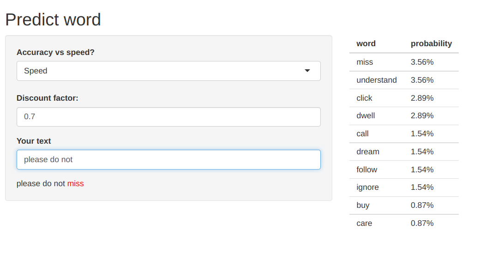

```{r setup, include=FALSE}
options(htmltools.dir.version = FALSE)
```

# Overview

Link to [app](https://haivo.shinyapps.io/cousera-capstone-app/)

Link to [github](https://github.com/vohai611/cousera-capstone-app)

---
# Manual 

  -   This app is extremely simple, you just fill the "Your word" box and shiny will bring back the prediction

  -   The table on the right hand side will show top 10 highest probability word, according to the Katz back-off model.
  
  -   There are two options on the right-hand side
    
    -   **Accuracy vs Speed**: if you choose **Speed**- the default option, app will use smaller database which are fast to load and give back prediction. Otherwise, with **Accuracy**, shiny will load large database and give better prediction with the cost of speed.
    
    - **Discount factor**: this is the discount parameter of Katz back-off model. In short, the higher the discount, the higher the chance word the rare word

---

# Screenshot

---
# Model explaination

  -   Input: the last two word of users.

  -   Output: the list of predicted word, sort by probability

This prediction app use [Katz back-off model](https://en.wikipedia.org/wiki/Katz%27s_back-off_model) for tri-gram. The algorithm work as follow:

  1. Create N-gram database (in this case is tri-gram)
  
  1. Estimate probability word $w_i$ appear with $w_{i-1}$ before it
  
  1. Estimate probability word $w_i$ appear with $w_{i-1}$ and $w_{i-2}$ before it
  
  1. Discount the above probability with factor $\gamma_2, \gamma_3$
  
  1. Assign the remaining probability to the word $w_i$ that never appear with $w_{i-1}$ and $w_{i-2}$ before it.

You can find my implementation of algorithm in my github [repos](https://github.com/vohai611/cousera-capstone-app/blob/master/R/katz_predict.R)


